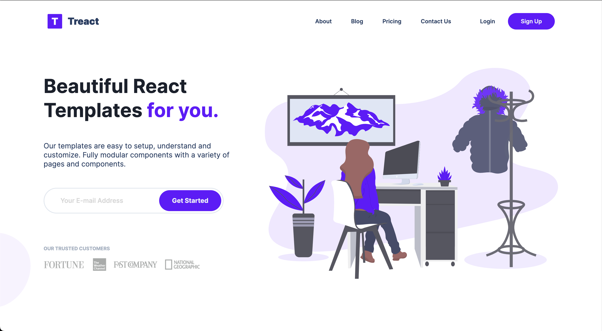
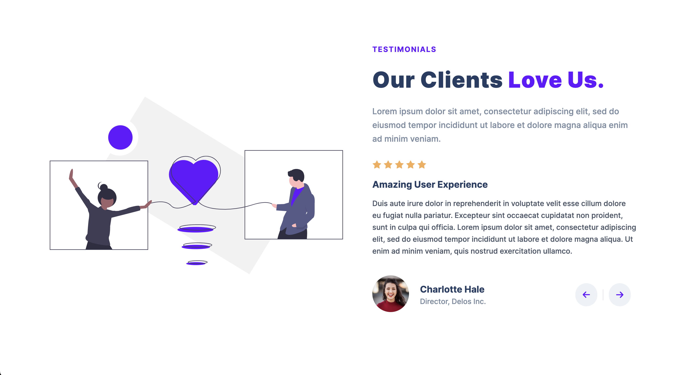
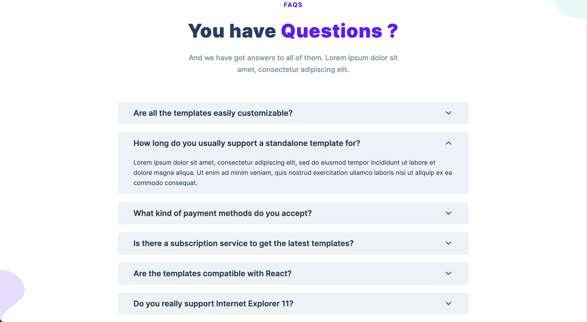

# T-React Project

## Description

T-React Project is a demonstration of frontend development expertise, crafted from scratch using HTML, CSS, and JavaScript to mimic the original T-React website. This site is designed to be fully responsive and user-friendly across all devices, showcasing best practices in coding and design. The project uses semantic HTML for better accessibility and SEO, ensuring that it adheres to modern web standards.

## Table of Contents

- [Demo](#demo)
- [Screenshots](#screenshots)
- [Features](#features)
- [Technologies Used](#technologies-used)
- [Conclusion And Credit](#conclusion-and-credit)

## Demo

[Click Here To See The Hosted Site](https://mhmdlsiblini.github.io/T-React-Project/)

## Screenshots:

 

  

## Features

- **Responsive Design**: Implements media queries to ensure the site looks great on any device.
- **Interactive Elements**: Features like accordions, sliders, and smooth scroll effects enrich user interaction.
- **Reusable Code**: Modular coding makes updates and edits efficient and straightforward.
- **Semantic HTML**: Enhances accessibility and search engine optimization.

## Technologies Used

- **HTML**: Structured and semantic markup.
- **CSS**: Advanced styling with flexbox, custom properties, and responsive design techniques.
- **JavaScript**: Vanilla JavaScript for dynamic content and interactive features.

## Conclusion and Credit

This project was crafted to display proficiency in reproducing various web features and enhancing them with a clean and modern approach.

Many thanks to the owner of the original T-react Website [Owais](https://github.com/owaiswiz)

[Link to Original Site For Comparison](https://treact.owaiskhan.me/components/landingPages/SaaSProductLandingPage)